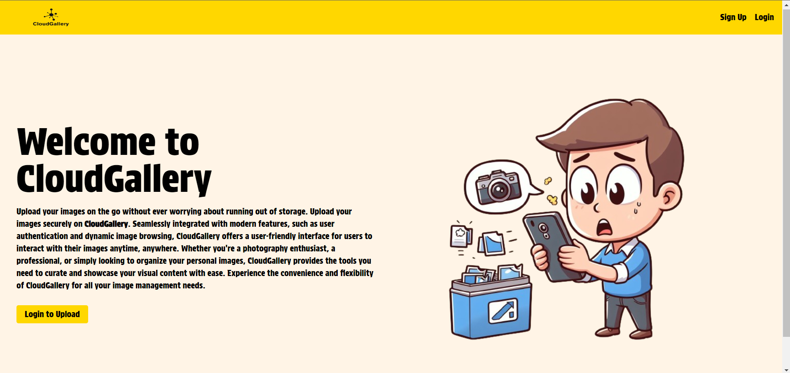
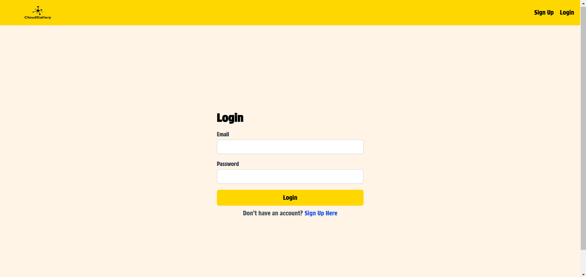
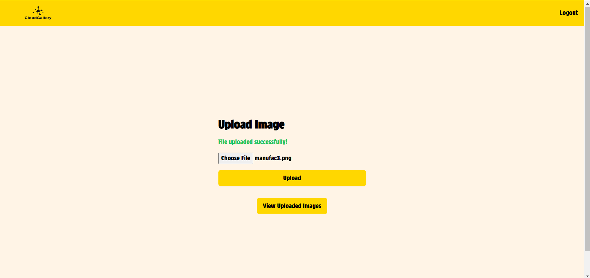
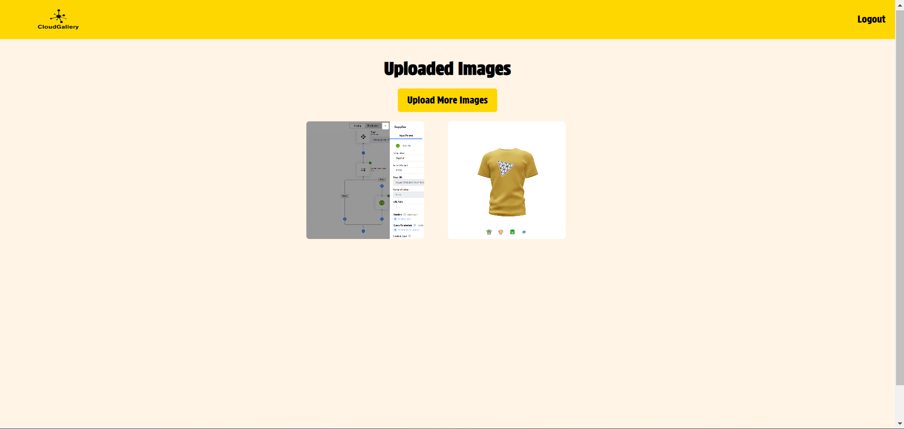

# CLOUD GALLERY






## Description
No need to worry about running out of space ever again on your device. With the help of cloud gallery you can store the images with us and get them when you need.

## Installation

### Prerequisites
- Node.js and npm installed on your machine.

### Steps

1. **Clone the repository**:
    ```sh
    git clone https://github.com/AnshAtreja/CloudGallery.git
    ```

2. **Navigate to the project directory**:
    ```sh
    cd cloud_gallery
    ```

3. **Install dependencies**:
    - For the client:
        ```sh
        cd client
        npm install
        ```

    - For the server:
        ```sh
        cd ../server
        npm install
        ```

4. **Set up environment variables**:
    - Create a `.env` file in the `server` directory:
        ```sh
        cd server
        echo "MONGO_URI=your_mongo_uri_here" > .env
        echo "PORT=5000" >> .env
        ```

## Usage

1. **Start the application**:
    ```sh
    cd client
    npm start
    ```

    This will run both the server and client side of the application

## Project Working Video   

Watch our tutorial video to get an overview of the project:

- [Project Video](https://drive.google.com/file/d/1hlJY5KG9jMVsDesvZTiErT41h5uS10NK/view?usp=drive_link)

- <a href="https://drive.google.com/file/d/1hlJY5KG9jMVsDesvZTiErT41h5uS10NK/view?usp=drive_link" target="_blank">Project Video</a>

## Contributing
Contributions are welcome! Please open an issue or submit a pull request.
